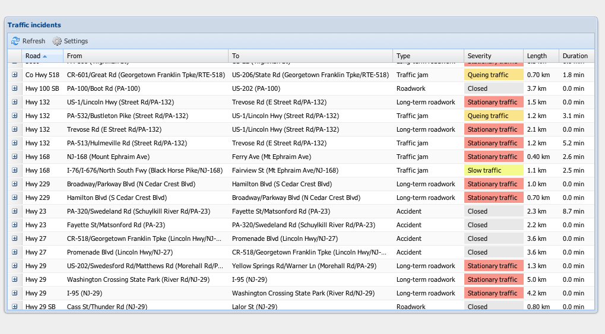

# TomTom-Live-Traffic-Api-Example

## License
Copyright (c) 2012, Bobbie Smulders

Contact: <mail@bsmulders.com>

## Project goal

This project houses the web application example belonging to this blogpost: [Using the TomTom Live Traffic API](http://bsmulders.com/2012/03/using-the-tomtom-live-traffic-api/)

## Project components

* The JS directory contains the Ext JS application and a small Proj4js testscript 

## Usage

Open the index.html webpage in a browser. When using Chrome, run the browser with parameter "--disable-web-security". This enables cross-domain requests. This script will not work when it's uploaded to a HTTP server.
